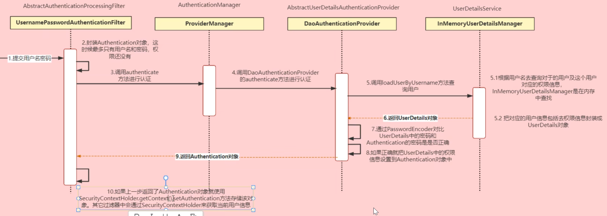
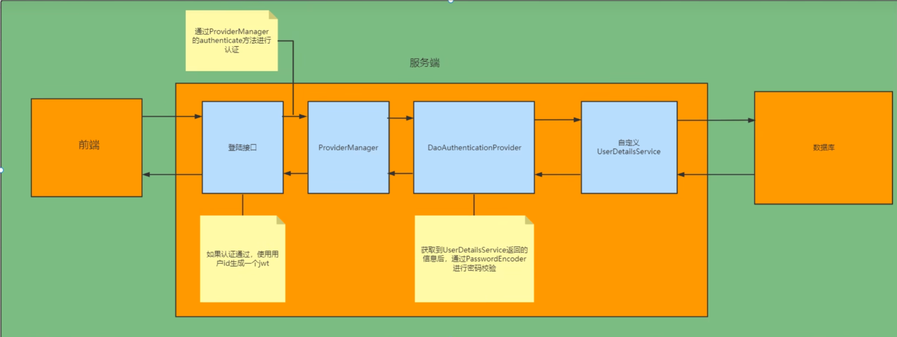
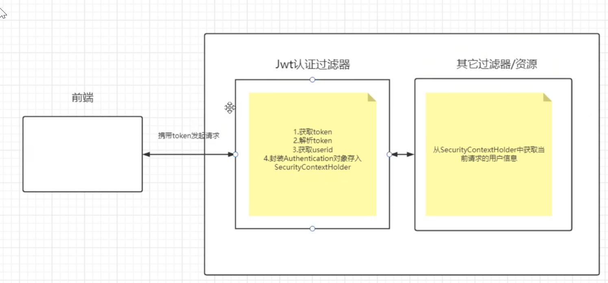

  
  

## 配置类
### 1、安全框架配置
#### 安全框架需要手动配置SecurityManager将其加入到Spring容器中，安全过滤链，其中包括jwt过滤链，由于要使用token代替原有的表单登录，所以jwt过滤链要加在UsernamePasswordAuthenticationFilter前面，以及将登录密码的加密方式也要在配置类中配置。
### 2、redis配置
#### redis需要配置序列化器，这是解决乱码的，如果没有配置序列化器，那么在redis重点看到的将是乱码，并且还要配置能够支持Java8时间类型以及还要解决类型转化失败的问题
##### 但是本次的redis配置似乎还是有些问题的，redis的hash类型的第二个key不能存储Long类型的数据需要手动转成String类型
### 3、线程池的配置
#### 需要配置核心线程数、最大线程数、队列大小、当线程池满了队列也满了之后的拒绝策略以及最后还要配置线程池关闭要等待所有的任务完成后才能够关闭
### 4、阿里Oss配置
#### Oss的基础配置以及初始化Oss客户端对象
### 5、MybatisPlus配置
#### 开启分页插件功能
## 工具类
### 1、异步执行上传视频任务
### 2、Jwt工具类，用来生成和解析token
### 3、文件工具类
#### (1) 判断用户上传的是否是图片
#### (2) 将用户传输的图片上传到Oss中
#### (3) 将用户传输的图片保存在本地(未使用到)
### 4、定时任务工具类
#### 定时每10分钟将用户点击量加入到数据库
#### 定时每天凌晨3：05加载排行榜
## 数据库
### 1、user用户表
#### id字段：雪花算法生成用户id，主键
#### username字段
#### password字段：存储加密后的密码
#### avatar_url字段：存储上传到Oss中的网页地址
#### created_at、updated_url、deleted_at
### 2、video视频信息表
#### id字段：雪花算法生成视频id，主键
#### user_id字段：存储视频发布者的id，普通索引
#### video_url字段：存储上传到Oss中的视频对应的网页地址
#### cover_url字段：存储封面的网页地址，视频的第一帧当作视频封面，该地址是在视频地址的基础上拼接得到的
#### title字段：视频标题
#### description字段：视频描述
#### visit_count字段：视频被点击的次数
#### like_count字段：视频被点赞的数量
#### comment_count字段：这个视频中的所有评论的数量
#### created_at、updated_url:索引、deleted_at
### 3、like点赞表
#### id字段：雪花算法生成
#### user_id字段：点赞的用户id，索引
#### video_id字段：存储用户点赞的视频id
#### comment_id字段：存储用户点赞的评论id
#### created_at字段：存储点赞时间，索引
### 4、comment评论表
#### id字段：评论id
#### video_id字段：评论所属的视频id
#### user_id字段：发表评论的用户id
#### root_id字段：评论所在的第一条评论（即直接回复视频的评论）
#### parent_id字段：评论回复的是哪条评论
#### replay_user_id：被回复的评论的发表者
#### content字段：评论内容
#### like_count字段：评论被点赞的数量
#### child_count字段：回复这条评论的数量
#### created_at、updated_at、deleted_at
### 4、relation关系表
#### id字段：雪花算法生成
#### user_id字段：发起关注的用户id
#### focus_user_id字段：被关注的用户id
#### flag字段：是否好友，即是否互相关注，0：非好友，1：好友
#### created_at、updated_at